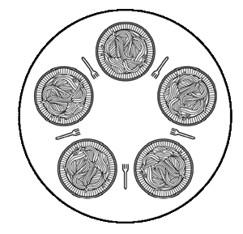

# Philosophers Dinner Problem

Jantar dos Filósofos Descrito no Livro Sistemas Operacionais Modernos - Tenenbaum Pág.115 A vida de um filósofo consiste em alternar 
períodos de alimentação e pensamento. (Trata-se de um tipo de abstração, mesmo para filósofos, mas as outras atividades são 
irrelevantes aqui.) Quando um filósofo fica suficientemente faminto, ele tenta pegar seus garfos à esquerda e à direita, um de 
cada vez, não importa a ordem. Se for bem sucedido em pegar dois garfos, ele come por um tempo, então larga os garfos e continua 
a pensar. A questão fundamental é: você consegue escrever um programa para cada filósofo que faça o que deve fazer e jamais 
fique travado?
 
